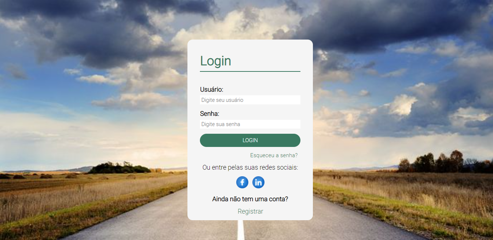

# Projeto Login 🖥️

> Projeto Interface de Login padrão com cores e design modificados; 
> ◾ Feito em grupo com propósitos de networking e colocar projetos reais em prática;

### Tecnologias usadas:
 
   
   

## 🤝 Colaboradores

<a href="https://www.linkedin.com/in/marcusviniciusbeghelisantos/" target="_blank">Marcus Vinícius</a> 

<a href="https://www.linkedin.com/in/thiago-leal-de-souza-56046020b/" target="_blank">Thiago Leal

